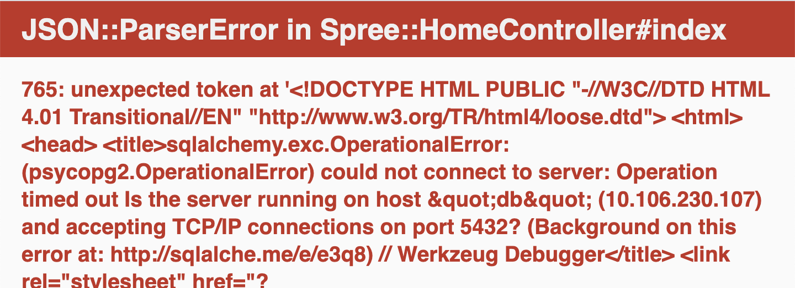

Lab1
We have set up a Kubernetes cluster for you. You can check the cluster node and the Kubernetes version it is running by executing this command:
```
kubectl get nodes
```
You should get an output similar to:
```
NAME         STATUS   ROLES                  AGE     VERSION
kubernetes   Ready    control-plane,master   50s     v1.23.6
worker       Ready    <none>                 58s     v1.23.6
```
Check what pods you are running in our control plane node by executing the following command:
```
kubectl get pods --all-namespaces --field-selector spec.nodeName=kubernetes
```
You should get an output similar to this:
```
NAMESPACE         NAME                                       READY   STATUS    RESTARTS      AGE
calico-system     calico-kube-controllers-65b6c76867-qmqfz   1/1     Running   0             23m
calico-system     calico-node-5pt75                          1/1     Running   0             23m
calico-system     calico-typha-dcf947cbd-ft9st               1/1     Running   0             23m
kube-system       coredns-64897985d-rgnlf                    1/1     Running   0             23m
kube-system       coredns-64897985d-xsvw5                    1/1     Running   0             23m
kube-system       etcd-kubernetes                            1/1     Running   0             24m
kube-system       kube-apiserver-kubernetes                  1/1     Running   1 (24m ago)   24m
kube-system       kube-controller-manager-kubernetes         1/1     Running   1 (24m ago)   24m
kube-system       kube-proxy-cpskj                           1/1     Running   0             23m
kube-system       kube-scheduler-kubernetes                  1/1     Running   0             24m
tigera-operator   tigera-operator-87b5d58c9-vkglw            1/1     Running   0             23m
```
As you can see, all Kubernetes control plane components (the api server, etcd, the controller-manager, and the scheduler) are running in the control plane node, as well as coredns and some pods that need to run on every node of the cluster, like kube-proxy and calico-node.

The ecommerce application is already provisioned for you in the ns1 namespace. You can check the different deployments that are part of the application by running the following command:
```
kubectl get deployment -n ns1 --selector=app=ecommerce && kubectl get deployment -n database
```
You should get output similar to this:
```
NAME             READY   UP-TO-DATE   AVAILABLE   AGE
advertisements   1/1     1            1           15m
discounts        1/1     1            1           15m
frontend         1/1     1            1           15m
NAME   READY   UP-TO-DATE   AVAILABLE   AGE
db     1/1     1            1           15m
```
The ecommerce application consists of a big monolith application called frontend, a microservice that serves advertisements, a microservice that serves discounts coupons and a postgres database.

Check that all the pods are running correctly by running the following command:
```
kubectl get pods -n ns1 --selector=app=ecommerce && kubectl get pods -n database
```
At this point you can visit the ecommerce application by clicking on the Ecommerce App tab in the terminal. Browse around to familiarize yourself with the application. Can you tell what areas of web page are served by the advertisements and discounts microservices?

Note: if you get an error like the one shown below, please refresh the page. It happens when the database is still initializing:


