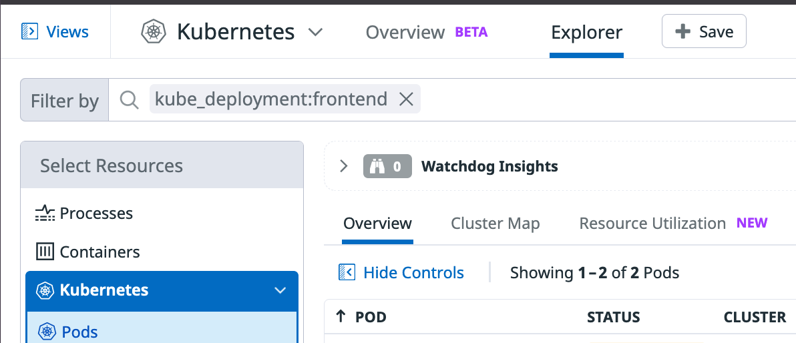
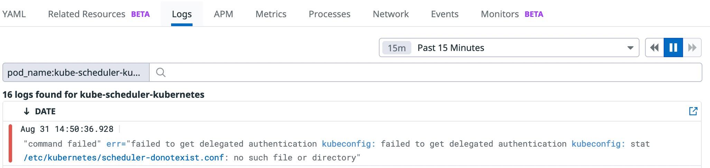
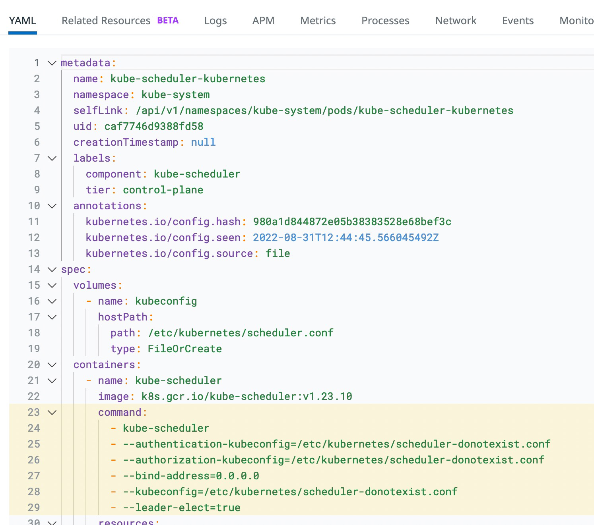

We are going to use Datadog to identify an issue happening on the control plane of our cluster and we will fix it.

# Lab10

## Scenario

The Frontend team attempted to deploy a new version of their application (Deployment ns1/frontend). However, nothing happened after applying their new manifest. The old version is still online!

The Frontend team reaches out for help, they need to understand why the old version is still online.

## Initial Investiogation

The first thing you will do is to check the status of the ns1/frontend deployment.

Open the Kubernetes Explorer in Datadog and search for pods that are part of that deployment.



Is the new pod crash looping? If it is crash looping the problem may be on the new pod itself. You can check things like the manifest of the pod, the pod logs, etc. to try to determine what's wrong with the new pod.

Is the new pod marked as "Pending" instead? If the pod is "Pending" that means that the scheduler wasn't able to schedule the pod. This can be a capacity issue (there is no more nodes with enough capacity for the pod requests). This can also be a problem with the scheduler itself (something wrong with the pod running the scheduler, for example).

## Continuing with the Investiogation

OK, the problem is that the pod is pending. The first thing that comes to mind is that this could be a capacity issue.

Navigate to Dashboards > Dashboard List to search for the Kubernetes Cluster Overview dashboard and verify if this is the case.

The section called Cluster Health Overview section will give you a summary of all requests in your cluster (both CPU and memory) against the capacity of the cluster.


In this section, check if the CPU and/or memory requests are very close to the cluster capacity, which could explain the pending pod.

Is this the case?

## Further Investiogation

OK, the cluster is still very far from reaching its capacity, so this doesn't seem to be the reason why our pod is not being scheduled.

So the next bet is that the scheduler might not be behaving correctly. Check the status of the scheduler pod.

Open the Kubernetes Explorer in Datadog and search for pods in the control plane tier.

What's the status of the scheduler pod? And what hint does that particular status give us for how to fix the issue?

## Fixing the issue

The pod is crash looping, so it looks like there is something wrong in the scheduler manifest. Probably there were some changes made to how the scheduler gets deployed that broke the container.

Once you have identified what's wrong with the scheduler pod, fix the issue in your cluster, using the terminal.

Hints:

* To try to debug what's wrong with the manifest, click on the crash looping pod in Datadog and check the different tabs (especially YAML and Logs) to debug what's wrong.
* Note that the kube-scheduler is a static pod. In this enviroment, static pods can be found in /etc/kubernetes/manifests.

If you cannot figure out the issue or do not know how to fix it, click on "Solution" below:

## Solution

After clicking on the crash-looping pod investigate its logs:



You can see that we are pointing to a configuration file that doesn't exist.

Click now on the YAML tab to see where we are pointing to that file:



Fix the command in the kube-scheduler definition. Open the Editor tab and edit the kube-scheduler.yaml file.

Change the command definition to:

```
command:
  - kube-scheduler
  - --authentication-kubeconfig=/etc/kubernetes/scheduler.conf
  - --authorization-kubeconfig=/etc/kubernetes/scheduler.conf
  - --bind-address=0.0.0.0
  - --kubeconfig=/etc/kubernetes/scheduler.conf
  - --leader-elect=true
```

As this is a static pod, the pod will restart as soon as we save the file and the scheduler should restart correctly.
