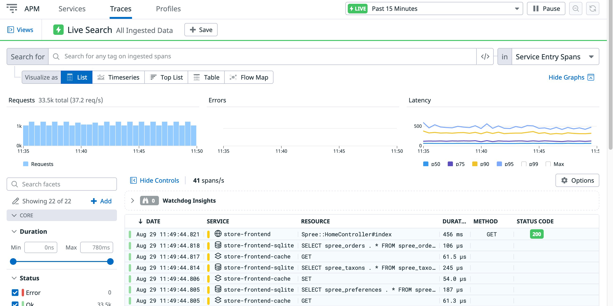
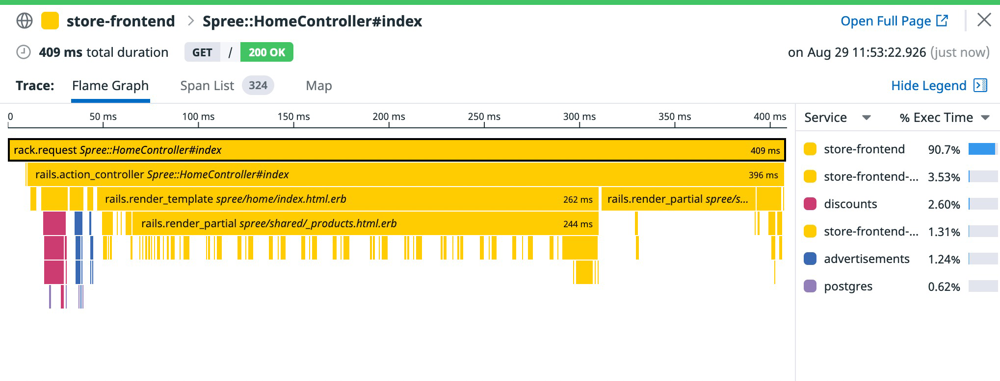
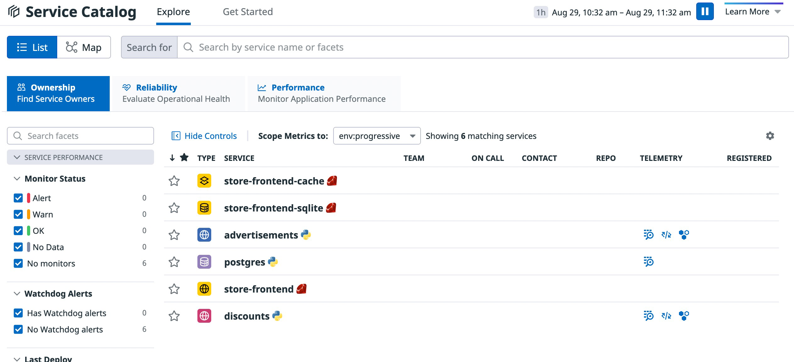
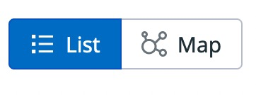
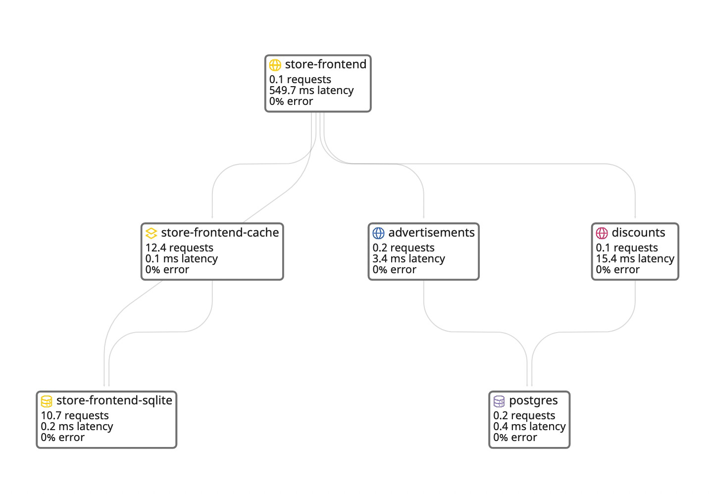

On this challenge we will understand how we can monitor applications that are deployed to Kubernetes. You will need to answer some questions about the state of the ecommerce application using Datadog.

#Lab 12

## The Ecommerce application

As explained during the first step of this workshop, there is an E-commerce application deployed in your Kubernetes cluster. Open the application again by clicking on the "Ecommerce App" tab to get yourself familiar with the application.

The application is already instrumented for APM, and sending traces to Datadog.

Check the traces that are being sent to Datadog in real time. Navigate to APM -> Traces:

You will be able to see the traces generated by the traffic in your application flowing into Datadog.

Click on one of the traces to reveal the flame graph associated with that trace.

❓ What do you see on that flame graph? What are the tasks that make up most of the latency of that trace?

Flame graphs of individual traces are very useful when investigating a specific error, as you can see exactly where that error is happening.

## Service Catalog

As modern applications tend to follow a micro services architecture, and with different teams owning different services, sometimes is difficult to get a global picture of the full distributed application.

Thanks to APM, Datadog will generate a "service catalog" of any application sending telemetry data to its backend. Navigate to APM > Service Catalog to visit the service catalog of our current cluster.

In the Service Catalog you will see each of the services of your application and some of their golden signals, like latency, traffic or errors.

Although we will focus on this workshop on the APM features of the Service Catalog, this Datadog feature will also track service ownership (what team owns it, who is on call, etc.) and relibility data (last deploy, incidents, etc.). You can read more about the Service Catalog on its official documentation.

### Service Map
Another pain point with multi-service architectures is to have up-to-date architecture diagrams of the applications. What services are talking to each other? How is the traffic flowing through the services?

Instead of having to have a static diagram that needs to be updated on any relevant code change, thanks to APM we can have an always up to date diagram, with up to date communication within each of the services.

Click on the "Map" button on the top-left corner of the Service Cartalog window:

You will get a map similar to this one:

❓ How many sub-services does the frontend service have?
❓ Does the advertisements service talk to the discounts service?
❓ How many requests/second is the frontend service getting?
❓ Are there any errors?

