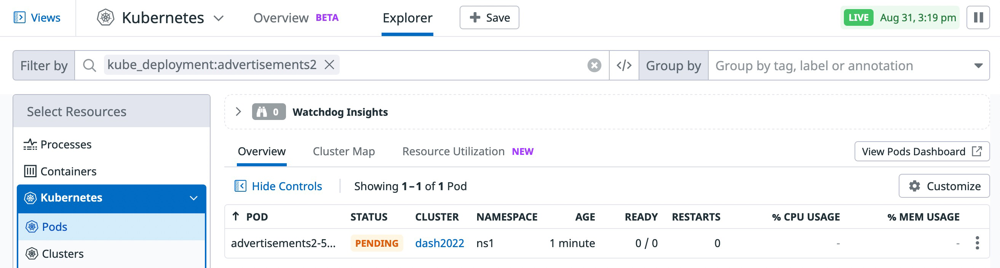
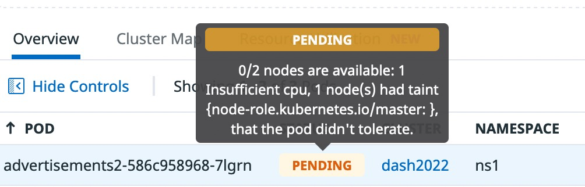
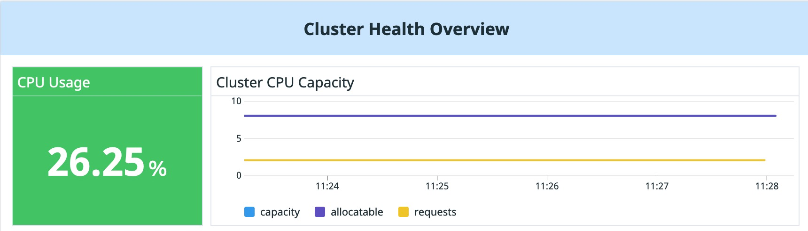
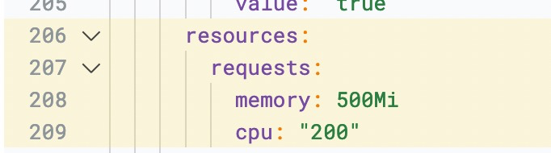

# Lab 15

## Scenario

The advertisements team is launching a new version of the application. The most notable change of this new version is that the banner that the service will provide reads "Version 2.0", instead of "Version 1.0".


Instead of rolling out this new version to all users at once, they planned for a simple canary deployment. They deployed this new version alongside the old one, so 50% of the time users will get "Version 1.0" and the other 50% "Version 2.0". That way they are able to compare the two versions before rolling out to all of their users.

## Something is not quite right ...

Open the application by clicking on the "Ecommerce App" tab and refresh the page several times.

You can see that you are always getting "Version 1.0", instead of getting 50% of the time "Version 1.0" and 50% "Version 2.0". What's going on?

First, check that the pods are running correctly. Navigate to Infrastructure > Kubernetes and in the Explorer tab search for pods that are part of the advertisements2 deployment:



As you can see, the pod is marked as "Pending". Figure out what's wrong with the new deployment and fix the issue.

Hints
* Hovering on the word "Pending" will give you a hint on why the pod is pending
* Clicking on the pod, you get the pod details side panels with a lot of information about the pod, including its YAML definition
* The definitions of the different deployments are available in the manifest-files folder

If you cannot figure out the issue or do not know how to fix it, click on "Solution" below:

## Solution

Hovering on the "Pending" message of the pod, you can see that the reason why the pod is pending is that there is no sufficient CPU on our cluster for this pod.



Navigate to Dashboards > Dashboard List to search for the Kubernetes Cluster Overview dashboard and review the status of the cluster.



If you hover over the graph lines, you can see that your cluster has available 8 cores, and only about 2 are being used. There should be enough capacity for the advertisements micro-service.

Check the definition of the service to see how much it is requesting.

Navigate back to Infrastructure > Kubernetes and in the Explorer tab search for pods that are part of the advertisements2 deployment.

Click on the pending pod to open its side panel. Review its YAML definition to see what this pod is requesting:



The pod is requesting 200 cores! This is clearly a typo. Indeed, if you diff between the definition of the advertisements and the advertisements2 deployments you can see that someone removed an m (meaning millicores) in the definition:

```
diff --color /root/lab/manifest-files/ecommerce-v1/advertisements.yaml /root/lab/manifest-files/adsv2/advertisements.yaml
```

```
7c7
<   name: advertisements
---
>   name: advertisements2
26c26
<       - image: arapulido/ads-service:1.0
---
>       - image: arapulido/ads-service:2.0
33c33
<             cpu: "200m"
---
>             cpu: "200"
52c52
<             value: "1.0"
---
>             value: "2.0"
```

Open the Editor tab and edit the file called adsv2/advertisements.yaml and re-add the m to the CPU requests.

Re-apply the definition:

```
kubectl apply -f /root/lab/manifest-files/adsv2/advertisements.yaml
```

Check the status of the pods in the ns1 namespace:

```
kubectl get pods -n ns1
```
Is the advertisements2 pod now running? Great! Go back to the "Ecommerce App" tab and refresh the application several times. You can see that sometimes you get "Version 1.0" and sometimes you get "Version 2.0".
