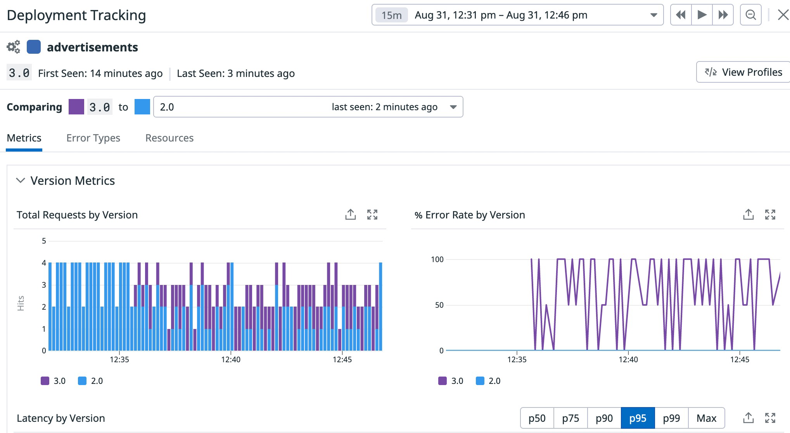

# Lab 16

## Introduction

The advertisements team was happy with version 2.0 of their service, so they removed version 1.0 from the cluster, so every user gets that one now.

They have now deployed version 3.0 in a canary as well, so some users get the banner that reads "Version 2.0" and some get "Version 3.0". But, is this working correctly?

## Is the new version good to deploy to all of our users?

Container orchestrator like Kubernetes make it relatively easy to use canary deployments and other progressive delivery techniques to reduce the blast radius of a potential bug in your code. Kubernetes makes it also very easy to revert a potential harmful deployment.

Having a good observability strategy is key to quickly identify potential issues with our application deployments and being able to act as soon as possible, reducing the impact of bugs.

Datadog APM allows to easily compare several versions of your services for golden metrics like latency, errors, etc., to help you make the right decisions.

Navigate to APM > Services and click on the advertisements service to open its service page and to monitor the new service deployment.


You can see that the error rate is growing! But is this related to the new deployment?

Click on Deployments and View Details for version 3.0:


Once you are in the Deployment Tracking panel, compare this version to version 2.0:



You can see that the error rate is only coming from version 3.0, therefore, something is wrong with this new version and we need to revert it to allow us time to investigate the code.

## Reverting the change

The idea behind canary deployments is to be able to revert quickly the buggy deployment, before continuing deploying it to more users.

To complete this challenge, revert the change.

Hints

 * Deleting the deployment for the 3.0 version should bring all users back to only seeing the working version (2.0)

If you cannot figure out the issue or do not know how to fix it, click on "Solution" below:

## Solution

Remove the advertisements3 deployment:

```
kubectl delete deploy advertisements3 -n ns1
```

## Finish

Go back to the "Ecommerce App" tab and refresh the application several times. You should always get the "Version 2.0" banner.

Go back to the advertisements service page in Datadog. You should see now a drop in the error rate.


