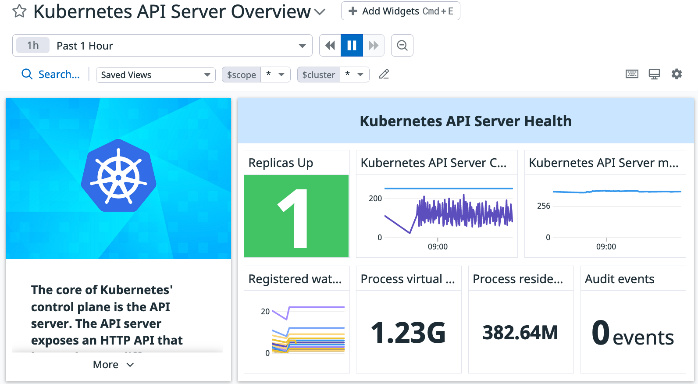
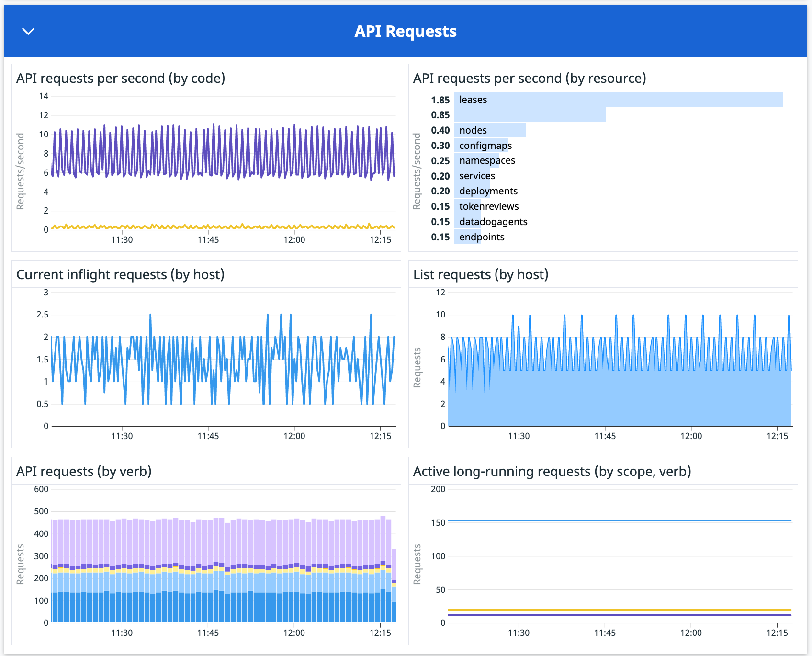
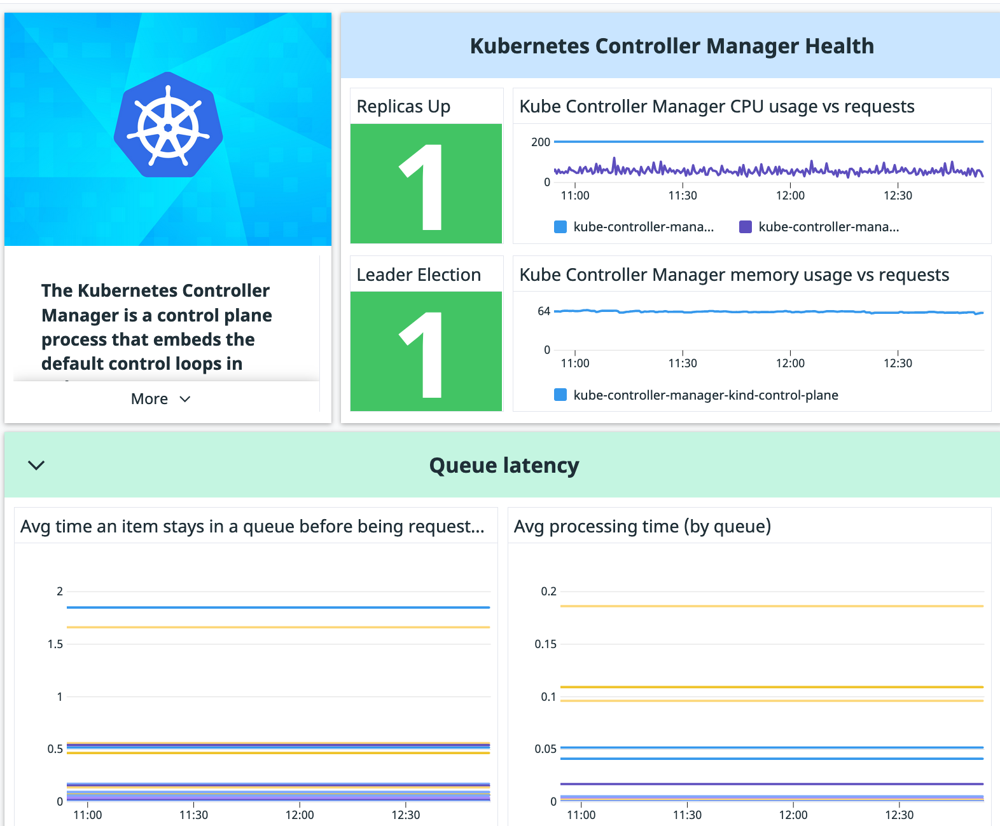
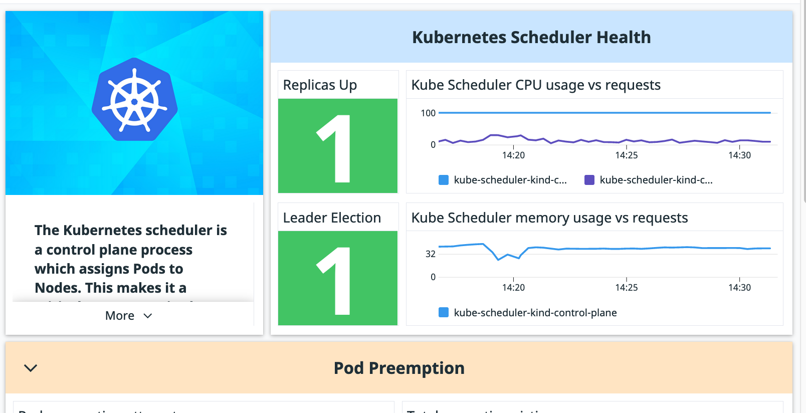
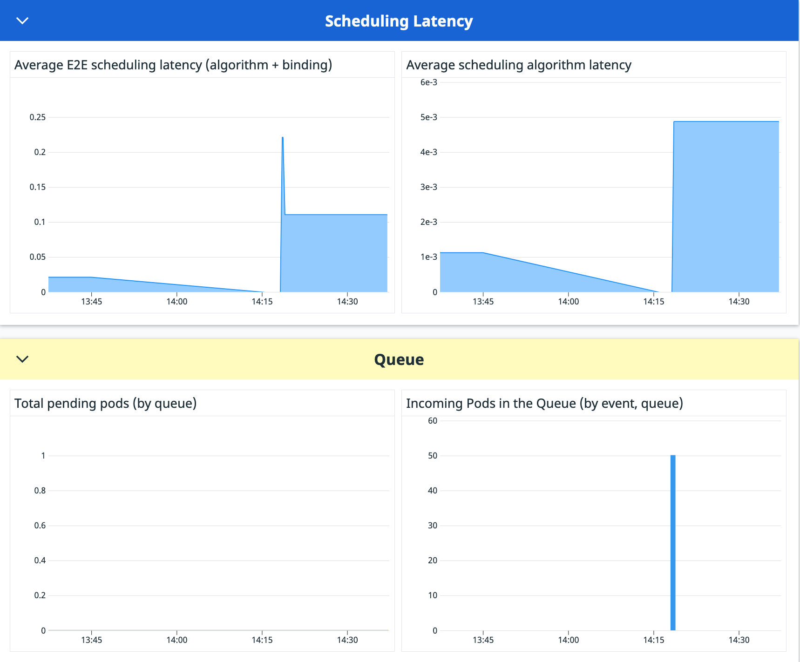
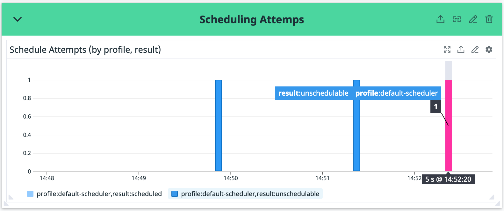
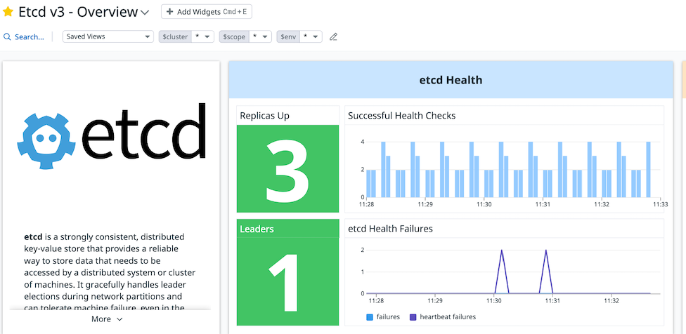
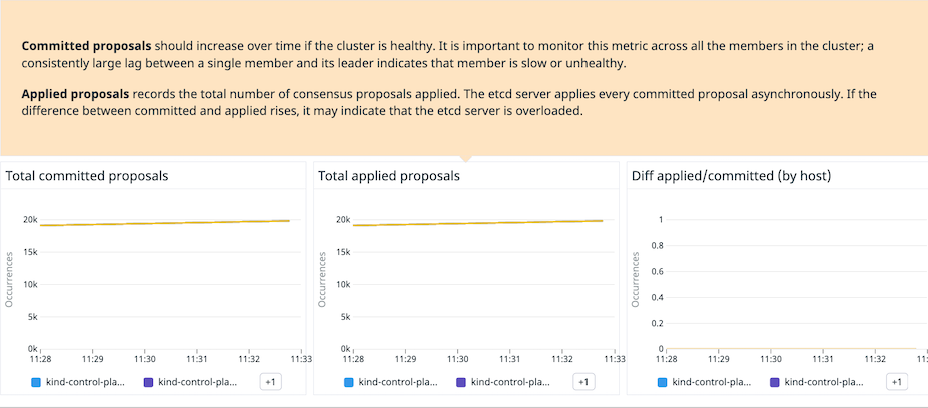

# Lab8

## Kubernetes Control Plane

The control plane are the Kubernetes components that manage the nodes and pods in a cluster. These are the API server, the controller-manager, the scheduler and etcd.

The control plane components can also run as containers in the same cluster, in nodes that have a node-role.kubernetes.io/control-plane label.

Check the nodes to see which one is the control plane node:
```
kubectl get nodes --show-labels
```

The node marked with a control-plane label is the node where the control plane components are running.

## The API Server

The first component that you are going to monitor is the API server. Check that it is running correctly by searching in the Containers view all containers running the kube-apiserver container image:

https://app.datadoghq.com/containers?query=image_name%3Ak8s.gcr.io%2Fkube-apiserver

The API Server is one of the most important Kubernetes components, and it is required to modify the state of your clusters (create new workloads, edit existing ones, delete others, etc.). If the API server is overloaded, new workloads won't be able to get scheduled, scaled or modified.

The Datadog Kubernetes integration has an out-of-the-box dashboard that will help you pin point potential issues with your Kubernetes API server.

Navigate to Dashboards > Dashboard List to search for the Kubernetes API Server Overview dashboard.



Spend some time browsing the information you get in the dashboard and try to answer the following questions:

❓ How many objects are in etcd based on what the Kubernetes API server sees?
❓ What verb is the most common one of the long running requests to the API server?

A section that is particularly important to check in the dashboard to understand the status of the API server is the API Requests section:



In that section you can watch the load of the API server. Some API requests are more expensive than others. For example, the list requests can be very expensive if the number of objects in etcd is very high. There is a widget just to watch on the list type requests.

❓ How many list requests per second is the Kubernetes API server receiving?

## The Controller Manager

The next component you will be looking at is the Controller Manager. Check that it is running correctly by searching in the Containers view all containers running the kube-controller-manager container image:

https://app.datadoghq.com/containers?query=image_name%3Ak8s.gcr.io%2Fkube-controller-manager

The Kubernetes Controller Manager is a control plane process that embeds the default control loops in Kubernetes. Examples of controllers that ship with Kubernetes today are the replication controller, endpoints controller, namespace controller, and serviceaccounts controller.

When something starts misbehaving in the cluster (for example, new pods not getting started) it is important to check if the controller manager (and the different controllers) is behaving correctly.

Navigate to Dashboards > Dashboard List to search for the Kubernetes Controller Manager Overview dashboard.



Review the state of the queues and the queue latency, including the time an item stays in the queue before it gets processed.

If those latencies grow a lot it may mean that, either a process is creating too many objects, or that we should start thinking about scaling the controller manager.

Force creating a lot of deployments and watch those latencies increase. Execute the following command to create 50 NGINX deployments:
```
for i in {1..50}; do kubectl create deployment "$i" --image=nginx; done
```

Wait a couple of minutes for the graphs to catch up and answer the following questions:

❓ What was the latency increase in the deployment queue?
❓ What's the average time a deployment stays in the queue before it gets processed?

Let's remove all the deployments before moving on:

```
for i in {1..50}; do kubectl delete deployment "$i"; done
```


## The Kubernetes Scheduler
Check that the Kubernetes Scheduler is running correctly by searching in the Containers view all containers running the kube-scheduler container image:

https://app.datadoghq.com/containers?query=image_name%3Ak8s.gcr.io%2Fkube-scheduler

The Kubernetes scheduler is a control plane process which assigns Pods to Nodes. This makes it a critical component in the Kubernetes control plane that needs to be monitored.

If the scheduler is failing, or overloaded, many new workloads might stay as Pending for a long time (or forever, if the scheduler is completely down).

Navigate to Dashboards > Dashboard List to search for the Kubernetes Scheduler Overview dashboard.



Similar to the Controller Manager, it is interesting to have a look to the latency of the scheduling events and the status of the scheduling queues:



Also, if the scheduler doesn't find a suitable node for a workload it won't be able to schedule it, so checking for unsucessful scheduling attempts is a good way to make sure our workloads are being scheduled and run successfully, and fix any issues if they aren't. You are going to force this.

Open the Editor tab and check the file called unschedulable_pod.yaml. You can see that it has a nodeSelector field looking to schedule this pod to a node with the label kubernetes.io/hostname=do_not_exist but there aren't any nodes with that label, so the scheduler won't be able to schedule this one.

Create this pod:
```
kubectl apply -f /root/lab/manifest-files/examples/unschedulable_pod.yaml
```
Go back to the Kubernetes Scheduler default dashboard and check the "Scheduling Attempts" section. You will see soon that there is 1 unschedulable pod there:



Remove the pod before moving to the next section. Execute the following command:
```
kubectl delete -f /root/lab/manifest-files/examples/unschedulable_pod.yaml
```

## etcd

Check that the etcd container is running correctly by searching in the Containers view all containers running the etcd container image:

https://app.datadoghq.com/containers?query=image_name%3Ak8s.gcr.io%2Fetcd

etcd stores a record of the state of the cluster in a distributed key-value store so that other components can ensure that all worker nodes are healthy and running the desired workloads.

If etcd is misbehaving, the seen state of the cluster might be in discrepancy of the real state of the cluster, making it to misbehave.

Navigate to Dashboards > Dashboard List to search for the Etcd v3 Overview dashboard.



An interesting metric to pay attention to is applied vs committed proposals. On a healthy cluster both metrics should be increasing over time and the difference between them should be close to zero.



❓ Is your cluster getting near (or zero) differences between applied and committed proposals?
